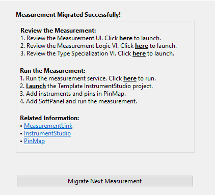
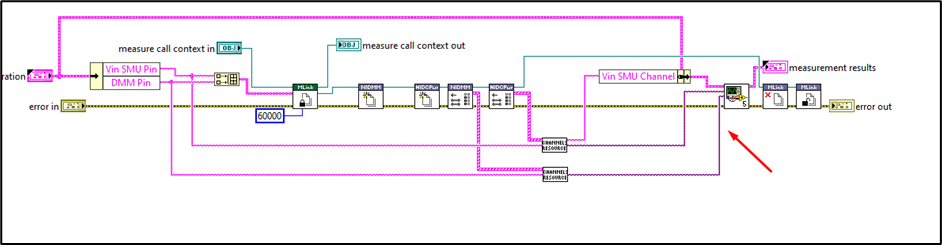

# InstrumentStudio Pro plug-in creation from existing measurements

- [InstrumentStudio Pro plug-in creation from existing measurements](#instrumentstudio-pro-plug-in-creation-from-existing-measurements)
  - [Problem Statement](#problem-statement)
  - [Links To Relevant Work Items and Reference Material](#links-to-relevant-work-items-and-reference-material)
  - [How to launch the migration tool](#how-to-launch-the-migration-tool)
    - [Alternative Design](#alternative-design)
  - [How to migrate existing measurement to InstrumentStudio Pro plug-in?](#how-to-migrate-existing-measurement-to-instrumentstudio-pro-plug-in)
    - [LabVIEW Project Selection](#labview-project-selection)
    - [Measurement Selection](#measurement-selection)
    - [Measurement plug-in name](#measurement-plug-in-name)
    - [Measurement plug-in description](#measurement-plug-in-description)
    - [Start Migration](#start-migration)
    - [Post Migration](#post-migration)
  - [Implementation/Design for Migration of measurements](#implementationdesign-for-migration-of-measurements)
    - [Creation of LabVIEW Project](#creation-of-labview-project)
    - [Copying the measurement vi](#copying-the-measurement-vi)
    - [Measurement Configuration and Result control updates](#measurement-configuration-and-result-control-updates)
    - [Measurement UI creation](#measurement-ui-creation)
    - [Measurement Logic Creation](#measurement-logic-creation)
    - [Type Specialization creation](#type-specialization-creation)
  - [Open Issues](#open-issues)
  - [Future Plans](#future-plans)

## Problem Statement

> The InstrumentStudio Pro users feel difficult to migrate their existing measurement into InstrumentStudio Pro plug-in. 
> The migration tool helps them in migrating
> the existing LabVIEW measurements into InstrumentStudio Pro plug-in

## Links To Relevant Work Items and Reference Material

- [Feature 2701542: Publish the migration tool in public repo](https://dev.azure.com/ni/DevCentral/_workitems/edit/2701542)
- [Prototype Source Code](https://github.com/ni/measurement-migration-tool/tree/users/smurugan/migration-tool)
- [Demo Recording](https://nio365.sharepoint.com/:v:/r/sites/ModernLabReferenceArchitecture/Shared%20Documents/Recordings/Measurement%20Migration%20tool%20-%20LabVIEW/Migration%20Migration%20Utility%20-%20Demo.webm?csf=1&web=1&e=jmFFbq)

## How to launch the migration tool

Migration tool will be part of Measurement Generator. To launch migration tool, Open LabVIEW->Tools->Plug-Ins->Measurement->Create Measurement Plug-in tool. Select the `Create Measurement plug-in from existing measurements` and provide required inputs.
Hosting this migration tool as a part of generator will be an ideal approach since both (creating measurement service and migrating existing measurements) is going create new measurement plug-in.

### Alternative Design
Migration tool can be an independent tool as shown below.

Cons:
1. Number of VI packages for InstrumentStudio pro will increase

 
## How to migrate existing measurement to InstrumentStudio Pro plug-in?

Launch Create Measurement plug-in tool, select the option `Create Measurement Plug-in from existing measurements`.

### LabVIEW Project Selection

The active project path will be populated in the project path. Else `C:\Users\<user-name>\Documents\Measurement Plug-ins\Measurement.lvproj` will be used. If there are no project in the given directory, new project will be created.
If invalid path is given, warning will be shown and the `Migrate Measurement` button will be disabled.

### Measurement Selection

The measurement which should be migrated to InstrumentStudio pro plugin should be selected. If any other file type other than vi is selected, warning will be shown and the `Migrate Measurement` button will be disabled.

### Measurement plug-in name

The measurement plug-in name should be entered. 

### Measurement plug-in description

The measurement plug-in description can be entered.

### Start Migration

Click `Migrate Measurement` to start migration.

### Post Migration

Once the migration is completed, documentation for the next steps are displayed.

## Implementation/Design for Migration of measurements

Migration of measurement includes the following features
1. Creation of LabVIEW Project and InstrumentStudio Pro plug-in template
2. Copying the measurement vi
3. Measurement Configuration control updates
4. Measurement Result control updates
5. Measurement UI creation
6. Measurement Logic Creation
7. Type Specialization creation

### Creation of LabVIEW Project

The tool checks if the provided LabVIEW project already exists in the directory. If the project exists in the location, the measurement  plug-in is added to the existing project. If there is no project available, a new LabVIEW project is created and the template measurement plug-in is added to the project.

### Copying the measurement vi

For the initial version, only flat vis can be migrated into measurement plug-in. The measurement vi is copied to the plug-in folder directory. In the measurement all the controls are connected to the connector pane and the wrapper for the measurement is created. In the wrapper, measurement configuration and results and error controls are created and connected to the connector pane. This wrapper is used in the measurement logic. 

### Measurement Configuration and Result control updates

The controls and indicators used in the measurement vi are copied to the configurations and results control respectively except few controls. The controls are io controls, tab controls and any string control related to channel of the instrument names. For all the io controls, a string dropdown is created in the configuration controls. For measurement having tab controls or indicators, the controls and indiactors are read recursively and added to the configuration and result control respectively.

Cons:
1. Migration tool supports all types of controls. But if unsupported controls of the InstrumentStudio Pro is used, migration will be completed. Users should convert them to primitive/supported datatypes to run the service in IS pro.

### Measurement UI creation

The controls used in the Measurement vi are copied to the Measurement UI. The io controls are replaced with the string dropdown to populate the pin names and any control related to channel will be removed. 

### Measurement Logic Creation

There are measurement without any instruments drivers. For measurement without any instrument drivers, the wrapper created is placed directly in the measurement logic vi. For the measurement which uses instrument drivers will always be converted to pin centrics measurement and session manager APIs are placed in the measurement logic. Session manager APIs includes, reserve session, initialize and get connections for the instrument used, close sessions and unreserve session are placed and wired. 

The pin to session conversion is not automated by the migration tool. Users should convert them.
Ther below is the image of the measurement logic post migration.
Wire the Pin Names to the corresponding input of the Get Resource Details.vim. Get Resource Details.vim will give the session and channel for the corresponding pin connected.

Connect the corresponding channel output and session output of the Get Resource Details.vim to the channel name and respective resource name in the wrapper.

### Type Specialization creation

For the pin names to be populated in the InstrumentStudio, all the dropdown created for the io controls should be mapped in the TypeSpecialization vi.
This is automated by the migration tool. The value in type specialization is created based on the instrument drivers used. Only pin type specialization is supported.

## Open Issues
1. Measurement modules must have at least one control and indicator and should not have more than 26 controls and indicators in total. This is due to the connector pane limitation. Maximum number of connector pane is 28 and 2 of the terminal is allocated for error in and error out.
2. Controls and Indicators label names must be unique.
3. Migration tool supports all the datatypes irrespective of the IS Pro.But post migration, users should update the configuration and results and do a workaround. Find the supported datatypes in IS pro [here](https://www.ni.com/docs/en-US/bundle/measurementlink/page/supported-datatypes.html)
4. Currently, any string control which has the label `channel` will be considered as channel name control and will not be added to configuration.
5. If the io controls are part of the cluster control, they cannot be indentified.
6. Measurements having splitters will result in the messy Measurement UI

## Future Plans
1. To migrate measurement which has dependencies(subVIS and controls)
2. To automate the workaround implementation for the unsupported datatypes
3. Event/Error logger for degugging
4. To migrate multiple measurement at a single run
