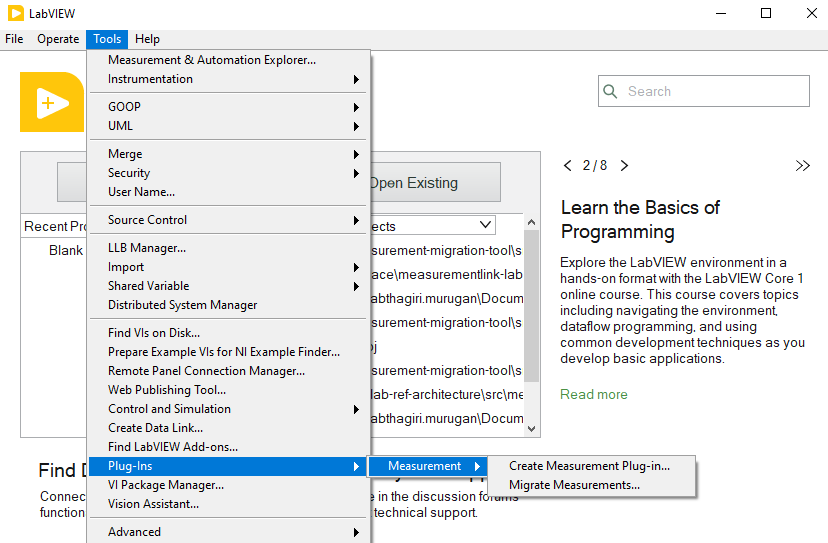
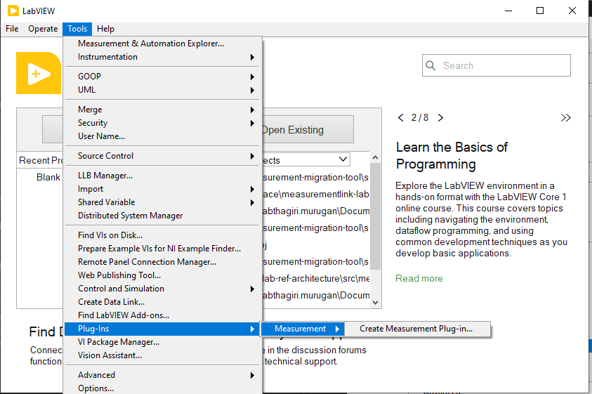
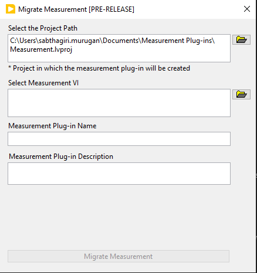
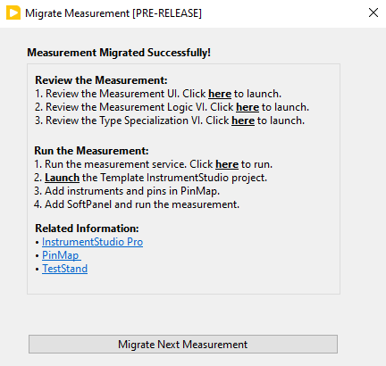
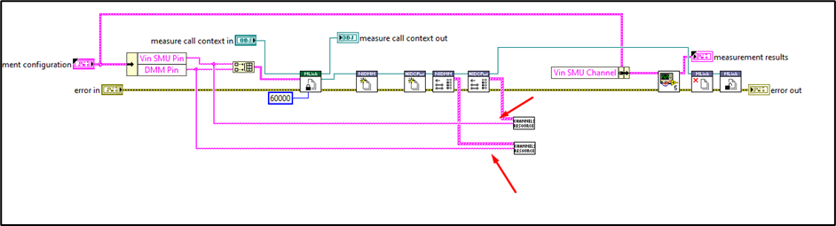

# Creating InstrumentStudio Pro plug-in from existing measurements

- [Creating InstrumentStudio Pro plug-in from existing measurements](#creating-instrumentstudio-pro-plug-in-from-existing-measurements)
  - [Problem Statement](#problem-statement)
  - [Links To Relevant Work Items and Reference Material](#links-to-relevant-work-items-and-reference-material)
  - [How to launch the migration tool](#how-to-launch-the-migration-tool)
    - [Alternative Design](#alternative-design)
  - [How to migrate existing measurement to InstrumentStudio Pro plug-in?](#how-to-migrate-existing-measurement-to-instrumentstudio-pro-plug-in)
    - [LabVIEW Project Selection](#labview-project-selection)
    - [Measurement Selection](#measurement-selection)
    - [Measurement plug-in name](#measurement-plug-in-name)
    - [Measurement plug-in description](#measurement-plug-in-description)
    - [Start Migration](#start-migration)
    - [Post Migration](#post-migration)
  - [Implementation/Design for Migration of measurements](#implementationdesign-for-migration-of-measurements)
    - [Creation of LabVIEW Project and InstrumentStudio Pro plug-in template](#creation-of-labview-project-and-instrumentstudio-pro-plug-in-template)
    - [Copying the measurement VI and its dependencies](#copying-the-measurement-vi-and-its-dependencies)
    - [Measurement Configuration and Result control updates](#measurement-configuration-and-result-control-updates)
    - [Measurement UI creation](#measurement-ui-creation)
    - [Measurement Logic Creation](#measurement-logic-creation)
    - [Type Specialization creation](#type-specialization-creation)
    - [Testing](#testing)
  - [Open Issues/Limitations](#open-issueslimitations)
    - [Future Plans](#future-plans)

## Problem Statement

> The InstrumentStudio Pro users feel difficult to migrate their existing measurement into InstrumentStudio Pro measurement plug-in. 
> The migration tool helps them in migrating
> the existing LabVIEW measurements into InstrumentStudio Pro plug-in

## Links To Relevant Work Items and Reference Material

- [Feature 2701542: Publish the migration tool in public repo](https://dev.azure.com/ni/DevCentral/_workitems/edit/2701542)
- [Prototype Source Code](https://github.com/ni/measurement-migration-tool/tree/users/smurugan/migration-tool/src/measurement_migration_tool)
- [Demo Recording](https://nio365.sharepoint.com/:v:/r/sites/ModernLabReferenceArchitecture/Shared%20Documents/Recordings/Measurement%20Migration%20tool%20-%20LabVIEW/Measurement%20Migration%20Utility%20-%20Demo.webm?csf=1&web=1&e=ZK3HLB&nav=eyJyZWZlcnJhbEluZm8iOnsicmVmZXJyYWxBcHAiOiJTdHJlYW1XZWJBcHAiLCJyZWZlcnJhbFZpZXciOiJTaGFyZURpYWxvZy1MaW5rIiwicmVmZXJyYWxBcHBQbGF0Zm9ybSI6IldlYiIsInJlZmVycmFsTW9kZSI6InZpZXcifX0%3D)
- [Migration Results](https://github.com/ni/measurement-migration-tool/tree/users/smurugan/migration-tool/src/Migration%20Results)

## How to launch the migration tool

To launch migration tool, Open LabVIEW->Tools->Plug-Ins->Measurement->Migrate Measurements. Migration Tool can be an independent tool.

Cons:
1. Number of options shown to the user will increase

### Alternative Design
Migration tool can be part of the `Create Measurement Plug-in`. Hosting this migration tool as a part of generator will be an ideal approach since both (create measurement plug-in and migrate measurements) are intended to create new measurement plug-in.

 
 ## How to migrate existing measurement to InstrumentStudio Pro plug-in?

### LabVIEW Project Selection

The active project path will be populated in the project path. Else `C:\Users\<user-name>\Documents\Measurement Plug-ins\Measurement.lvproj` will be used. If there are no project in the given directory, new project will be created.
If invalid path is given, warning will be shown and the `Migrate Measurement` button will be disabled.

### Measurement Selection

The measurement which should be migrated to InstrumentStudio pro plugin should be selected. If any other file type other than vi is selected, warning will be shown and the `Migrate Measurement` button will be disabled.

### Measurement plug-in name

The measurement plug-in name should be entered. 

### Measurement plug-in description

The measurement plug-in description can be entered.

### Start Migration

Click `Migrate Measurement` to start migration. Along with the migration of measurement, a template instrumentstudio project with pinmap will be created parallel to the folder

### Post Migration

Once the migration is completed, documentation for the next steps are displayed.

## Implementation/Design for Migration of measurements

Migration of measurement includes the following features
1. Creation of LabVIEW Project and InstrumentStudio Pro plug-in template
2. Copying the measurement VI and its dependencies
3. Measurement Configuration and Result control updates
4. Measurement UI creation
5. Measurement Logic Creation
6. Type Specialization creation

### Creation of LabVIEW Project and InstrumentStudio Pro plug-in template

The tool checks if the provided LabVIEW project exists in the location. If the project exists in the location, the measurement plug-in is added to the existing project. If there are no project available, a new LabVIEW project is created and the template measurement plug-in is added to the project

### Copying the measurement VI and its dependencies

Before migration of the measurement, the measurement along with its dependencies has to be copied parallel to the measurement template. So, all the dependencies of the selected measurements are fetched recursively. The dependencies are then investigated further to check if the dependencies are part of any library or if they are from the installed location. Dependencies that are from `C:\Program Files` and `C:\Program Files (x86)` are ignored. Dependencies that are part of a library are copied along with the library to the project.

### Measurement Configuration and Result control updates

The controls and indicators used in the measurement vi are copied to the configurations and results control respectively except few controls. The controls are tab controls, cluster controls and any string control related to channel of the instrument names. The io controls are replaced with the string dropdown to populate the pin names to pass the pin names from the measurement ui. For measurement having tab controls or indicators, the controls and indicators are read recursively and added to the configuration and result control respectively. Since cluster control/indicator is not supported, a string control is created in the measurement configuration and results respectively . The cluster data are serialized to string and passed in the gRPC layer. The implementation of serialization and deserialization is handled in the ui and measurement logic.

### Measurement UI creation

The controls and indicators used in the Measurement VI are copied to the Measurement UI. The io controls are replaced with the string dropdown to populate the pin names and any control related to channel will be removed. Since clusters are not supported in IS Pro, they should be converted to primitive datatype to pass the data through gRPC. As a result, a string control is created for each control and `value change event` is created and the logic for the conversion of cluster to string is implemented by the tool.
For all the cluster indicator, a string indicator is created, and the deserialization logic is implemented in the `Post UI Update` case.

Pros:
1. Support for clusters is automated. So users can migrate measurements having clusters and use them.

Cons:
1. Measurements having splitters will result in the messy Measurement UI.
2. The UI events are not migrated with this tool.

### Measurement Logic Creation

In the selected measurement, all the controls and indicators are mapped and connected in the connector pane. 
A wrapper is created for the selected measurement. In the wrapper, Measurement configuration control and measurement results indicator are placed and unbundling the configuration data and bundling the results data is handled. Controls are created for io controls that are used in the measurement and mapped in the connector pane in the wrapper. For cluster control/indicators are serialization and deserialization logic is also implemented by the tool.

There are measurement without any instruments drivers. For measurement without any instrument drivers, the wrapper created is placed directly in the measurement logic vi. For the measurement which uses instrument drivers will always be converted to pin centrics measurement and session manager APIs are placed in the measurement logic. Session manager APIs includes, reserve session, initialize and get connections for the instrument used, close sessions and unreserve session are placed and wired. 

The pin to session conversion is not automated by the migration tool. Users should convert them.
The below is the image of the measurement logic post migration.
Wire the Pin Names to the corresponding input of the Get Resource Details.vim. Get Resource Details.vim will give the session and channel for the corresponding pin connected.

Connect the corresponding channel output and session output of the Get Resource Details.vim to the channel name and respective resource name in the wrapper.

### Type Specialization creation

For the pin names to be populated in the InstrumentStudio, all the dropdown created for the io controls should be mapped in the TypeSpecialization vi. This is automated by the migration tool. The value in type specialization is created based on the instrument drivers used. Only pin type specialization is supported.

### Testing
The tool has been tested with different [sample measurement](https://github.com/ni/measurement-migration-tool/tree/users/smurugan/migration-tool/src/Test%20measurements) which has different instruments drivers.

## Open Issues/Limitations
1. When the dependencies are copied to new location, few subVIs and typdefs are not getting relinked to theire respective VIs, even if the relative path are maintained. Workaround is already in place, but reason for the issue has to be found.
2. Measurement dependencies not part of any library must be placed in the same directory or sub-directories of the measurement.
3. Dependencies which are not part of any library are added to a new library. Sometimes, an error is thrown saying adding these items would cause conflict.
4. Measurement modules must have at least one control and indicator and should not have more than 26 controls and indicators in total. This is due to the connector pane limitation. Maximum number of connector pane is 28 and 2 of the terminal is allocated for error control and indicator.
5. Controls and Indicators label names must be unique.
6. Migration tool supports all the datatypes irrespective of the IS Pro. Post migration, for the unsupported datatype/control, users should update the configuration and results and do a workaround. Find the supported datatypes in IS pro [here](https://www.ni.com/docs/en-US/bundle/measurementlink/page/supported-datatypes.html)
7. Any string control which has the label `channel` will be considered as channel name control and will not be added to Measurement configuration control.
8. For all the unsupported datatype, workaround has to be implemented.
9. If the io controls are part of the cluster control, they cannot be indentified.
10. For all the unsupported datatype, workaround has to be implemented.
11. The default value for the string will be empty and hence if users add the service IS Pro and click run, empty string will passed to the Measurement Logic and will result in error.
12. Copy paste functionality between soft panel or teststand will not update the cluster controls value, since clusters are not supported by the IS Pro.
13. The pin to session conversion is not automated. Users should obtain the session details and connect it to the wrapper.
14. The typedef used in the clusters are disconnected from the source. This is because, we have PPL for the ui library and all dependencies are copied the measurement library. So, PPL will not be built or will depend the source files.
15. Measurement with array of io controls is not handled.

### Future Plans
1. To automate the workaround implementation for the unsupported datatypes.
2. To migrate multiple measurement at a single run.
3. To figure out a way to copy the UI dependencies in the UI library.
4. Type Specialization - Support for path and enum. Automate type specialization creation for path and enum.
5. Error Logger Implementation.
6. Event Logger Improments.
7. All other minor backlogs are maintained in the [FEATURE: 2688894](https://dev.azure.com/ni/DevCentral/_workitems/edit/2688894)